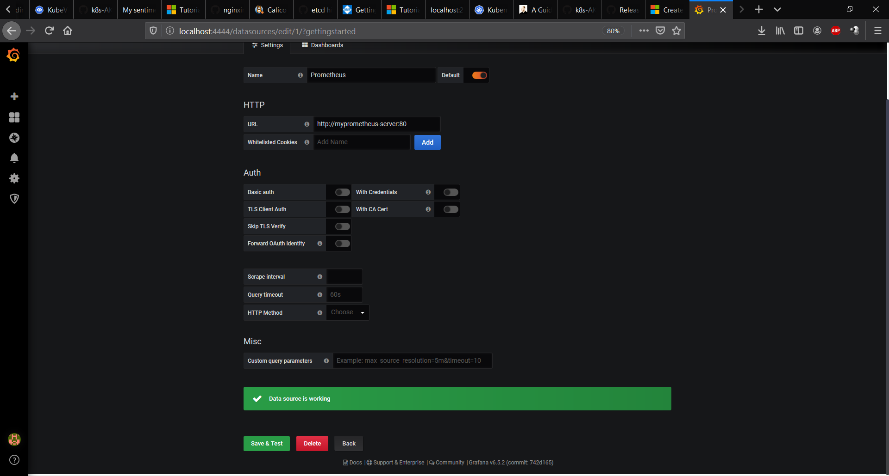

Installing Grafana
```bash
helm repo add stable https://kubernetes-charts.storage.googleapis.com/

helm repo update

helm install mygrafana stable/grafana --namespace=monitoring \
    --set=adminUser=admin \
    --set=adminPassword=admin \
    --set=service.type=LoadBalancer  \
    --set=service.port=4444
```

<pre>
NAME: mygrafana
LAST DEPLOYED: Thu Jun  4 23:33:10 2020
NAMESPACE: monitoring
STATUS: deployed
REVISION: 1
NOTES:
1. Get your 'admin' user password by running:

   kubectl get secret --namespace monitoring mygrafana -o jsonpath="{.data.admin-password}" | base64 --decode ; echo

2. The Grafana server can be accessed via port 4444 on the following DNS name from within your cluster:

   mygrafana.monitoring.svc.cluster.local

   Get the Grafana URL to visit by running these commands in the same shell:
NOTE: It may take a few minutes for the LoadBalancer IP to be available.
        You can watch the status of by running 'kubectl get svc --namespace monitoring -w mygrafana'
     export SERVICE_IP=$(kubectl get svc --namespace monitoring mygrafana -o jsonpath='{.status.loadBalancer.ingress[0].ip}')
     http://$SERVICE_IP:4444

3. Login with the password from step 1 and the username: admin
#################################################################################
######   WARNING: Persistence is disabled!!! You will lose your data when   #####
######            the Grafana pod is terminated.                            #####
#################################################################################


Use user and password given in helm chart (admin, admin) and change it !

In Grafana add data source, choose Prometheus, in URL put http://myprometheus-server:80
</pre>

```bash
helm list -n monitoring    
```
<pre>
NAME            NAMESPACE       REVISION        UPDATED                                 STATUS          CHART                   APP VERSION
mygrafana       monitoring      1               2020-06-04 23:33:10.3412484 +0200 CEST  deployed        grafana-5.1.2           7.0.1
myprometheus    monitoring      1               2020-06-04 23:22:58.4996371 +0200 CEST  deployed        prometheus-11.4.0       2.18.1
</pre>
```bash
kubectl get svc mygrafana -n monitoring
```
<pre>
NAME        TYPE           CLUSTER-IP     EXTERNAL-IP     PORT(S)          AGE
mygrafana   LoadBalancer   10.0.163.123   51.104.157.80   4444:30383/TCP   7m8s
</pre>

In Grafana add data source, choose Prometheus, in URL put http://myprometheus-server:80



kubectl get svc --namespace monitoring -l component=server
<pre>
NAME                  TYPE        CLUSTER-IP    EXTERNAL-IP   PORT(S)   AGE
myprometheus-server   ClusterIP   10.0.87.131   <none>        80/TCP    22m
</pre>
Literature:

https://blog.gojekengineering.com/diy-how-to-set-up-prometheus-and-ingress-on-kubernetes-d395248e2ba


Open 
http://51.104.157.80:4444/dashboard/import

and add example  
https://grafana.com/grafana/dashboards/10856
